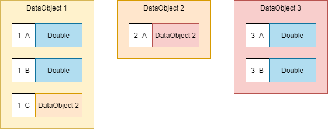
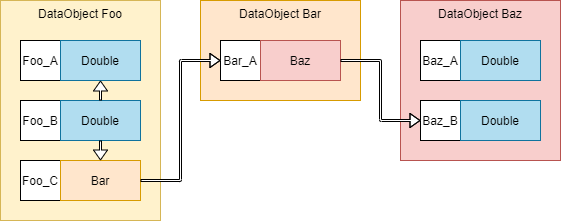

## DataField (TBD)
### DataCore
DataField can have there data controlled either externally by users via the set method or by a DataCore. A DataCore is 
an object that drives value changes in a field based on some programmatic input. If a DataCore is attached to a field it 
cannot be controlled manually.

DataCores are attached by attaching a DataCore_Schema to the DataField_Schema.

Any DataField with an attached DataCore is not saved.
#### Static_DataCore
A Static_DataCore is used when a field will have only one value that is assigned when the database is initialised. It 
primarily exists for DataField's that are defines in a parent object, are dynamic in other children but have fixed values 
in a specific child. As the name suggests the values of these fields cannot be changed.

```
dataObjectSchema.get(KEY).setDataCore_schema(new Static_DataCore_Schema<>(VALUE));
```
There is a special use case Static_DataCore where the value is calculated at initialization time. This mainly exists for 
cases there default values need to be extracted from the database. There is no guarantee that the load order will alloy 
this, so it may cause issues. 
```
dataObjectSchema.get(KEY).setDataCore_schema(new Static_DataCore_Schema<>(dataField -> CALCULATION));
```
@TODO 
This needs to be replaced with an explicit default object DataCore. (https://www.wrike.com/open.htm?id=734516415)
#### Derived_DataCore
The Derived_DataCore is the main object used for setting the value of a field based on data in other fields. It works by 
linking to the other fields and performing calculations based on the values of those fields, when any of those fields 
change. It consists of 2 key parts, the Calculators and the sources.

The Calculators are interfaces that must be implemented to perform the calculation to determine the fields value. All 
Derived_DataCore's must provide a main Calculator, this one does a full field recalculation based on all source data. 
Additionally, IndividualCalculator's can be provided for each source to allow the field to do a partial recalculation if 
only 1 field changes.

For example consider a simple case where the value of 1 field is determined by adding together the values of 3 other 
fields. In this case you would create you Derived_DataCore by providing a method to add the 3 values together 
(A + B + C = F) as well and 3 Sources linking to the 3 fields to add up. If any 1 of those fields changes the calculator
will be run again. Alternatively you may attach a IndividualCalculator to one of the sources that updates the value 
based only on its own changes (F = F - A_OLD + A_NEW). In this case there is not much performance improvements but for 
cases where you are summing all values in a subset of a list for example there can be extremely large improvements.
##### Source
The Source object is responsible for handling all required links to determine when a field changes and notifying the 
attached DataCore. They are also responsible for handling limited recalculation to help with optimization.

Source objects can be a bit convoluted to understand so for the following descriptions we will use the following example 
schema. In this example, a DataObject Foo, has 3 fields, 2 primitives and one linking to DataObject Bar. DataObject Bar 
then had a field linking to DataObject Baz that then has 2 primitive fields. 



Source objects work by forming a chain to their desired field. Let's consider an example case where the value of field 
Foo_B = Foo_A + Baz_B. Getting the value of Foo_A is easy, its in the same object as Foo_B but Baz_B is more 
complicated. To get its value we first need to find the instance of Bar from field Foo_C. We then need to get the 
instance of Baz from the field Bar_A. So for this problem we need 2 "Source chains".



1. Foo_A
2. Foo_C -> Bar_A -> Baz_B

Factories are provided to the user to generate these chains automatically, here is the example code for this case. This 
code assumes none of the links are allowed to be null. THe source object can handle a link being null, but the 
calculator would have to check for it.
```
dataObjectSchema.<Double>get(Foo_B).setDataCore_schema(
        new Derived_DataCore_Schema<>(
                (Calculator<Double, Foo>) container -> {
                    Foo foo = (Foo) container.getSource();
                    return foo.getA + foo.getC().getA().getB();
                }
                , Source_Factory.makeSourceChain(Foo_A)
                , Source_Factory.makeSourceChain(Foo_C, Bar_A, Baz_B)
```
The only rule when using these utilities is that the first link in the chain must be a field in the same DataObject. You 
can also attach a IndividualCalculator as the first parameter of the makeSourceChain method, see below for details on 
IndividualCalculator's.
###### Lists and sources
@TODO
Document the behavior of cases where the last element is a list (https://www.wrike.com/open.htm?id=735268303)
When one of the steps in the chain (other than the last one) is a list the source will still work as expected. All 
elements of the list will have listeners attached and will trigger recalculations as needed. The only difference is the 
behavior of the IndividualCalculator. The IndividualCalculator will pass up a list of changes instead of a single list 
in its old and new values. For example if one object is added to the list, the IndividualCalculator will get a List with
1 element in it containing the value of the field in the child object that is at the end of the chain. If one of the 
objects in the list changes its value, the IndividualCalculator will receive a list with 1 element as the old value 
and a list with 1 element in it for the new value. If a higher element in the chain is changed resulting in a new list 
instance in the list the IndividualCalculator will receive a list of all removed values as well as a list of all added
values.

@TODO
This method is not perfect as not enough information is provided to the calculator to do its job fully, this needs to be 
fixed (https://www.wrike.com/open.htm?id=735249543)
###### Shared chains
There are some cases where a DataCore may depends on multiple fields that go through a shared step in the chain. There 
is a factory method for this case. It currently only works when the first link is the same.
```
dataObjectSchema.<TYPE>get(KEY).setDataCore_schema(
        new Derived_DataCore_Schema<>(
                (Calculator<Double, Foo>) container -> {
                    return VALUE
                }
                , Source_Factory.makeSourceChain(Foo_A)
                , Source_Factory.makeSharedStepSourceChain(SHARED_FIRST_KEY, SECOND_FIRST_KEY, SECOND_SECOND_KEY, ...)
```
@TODO This is here to allow for better optimization but this is not currently implemented. 
(https://www.wrike.com/open.htm?id=734695856)
##### Derived_DataCore Factories
Some common configurations of Derived_DataCore and Source are exposed via factory methods for ease of use.
###### Direct Derived DataCore
This method will create a DataCore that makes the fields value directly equal the value of the field at the end of a 
source chain. YOu only have to provide the chain of keys for the desired field.
createDirectDerivedDataCore
```
dataObjectSchema.<TYPE>get(KEY).setDataCore_schema(createDirectDerivedDataCore(CHAIN_1_KEY, CHAIN_2_KEY, ...));
```
###### Self Parent List
All DataObjects have a field that contains all the DataObjects that have any fields pointing to them (unless flagged 
otherwise). createSelfParentList is used to create a second field with a subset of this list of a certain DataObject 
type. It can also have a set filter attached to limit it further.
```
dataObjectSchema.<List<TYPE>>get(KEY).setDataCore_schema(createSelfParentList(TYPE.class, SET_FILTER/null));
```
###### Multi Parent List
The multi parent list is the most common tool to create a subset of multiple other lists. It works by creating a list of 
DataObject that have multiple specific parents. The parents are provided by other fields. A set filter can also be 
provided to limit the list further.
```
dataObjectSchema.<List<TYPE>>get(PoolSummary_TransferSet).setDataCore_schema(
    createMultiParentList(TYPE.class,SET_FILTER, PARENT_1_KEY, PARENT_2_KEY, ...));
```
### FieldValidator
FieldValidator's are used to limit the available range of a data field above just its type. Any number of them can be 
attached to a DataField_Schema. They are check in series before any new value is applied to the field. If any of them 
fail the field will throw a NonCorruptingException.

FieldValidator's do not have a schema. They are attached directly to the DataField_Schema. They store no data about the 
field, all relevant context is only given at the time of validation. The FieldValidator should only need to be checked 
if the field its attaches to changes. If the range of the field depends on another field the Share_FieldValidator below 
should be used. The validator should never fail if it was run at any time other than the field change.

FieldValidator is an interface that can be implemented at a field by field bases or one of the common one's below can be 
used. 

FieldValidator are only run after a DataField is fully setup. As a result the field can go through invalid states during 
setup with no issues. For example all fields start as null.

@TODO
If a FieldValidator fails and was a result of a change made in another field (the field was driven by a DataCore) 
the exception is escalated to a Corrupting Exception (https://www.wrike.com/open.htm?id=732098723)

@TODO
If an integrity check is run, and a validator fails a Corrupting_Exception is raised. 
(https://www.wrike.com/open.htm?id=732099409)
#### Null_FieldValidator (used by all DataField_Schema)
All DataField's have a null validator attached by default. It can be enabled or disabled in DataField_Schema 
constructor. By default, DataField cannot have null values.
```
// Default, null value not allowed
DataField_Schema(NAME, TYPE)

// Directly set, can be null
DataField_Schema(NAME, TYPE, true)
```
#### NumberRange_FieldValidator
Number_FieldValidator can be used for any Type extending Number and implementing Comparable. The Min and Max values are
inclusive (Min <= value <= Max). If no min or max are provided then there is no limit in that direction.
```
// 1 or above
dataObjectSchema.<TYPE>get(KEY).addValidator(new NumberRange_FieldValidator<>(1, null));
// 1 or below
dataObjectSchema.<TYPE>get(KEY).addValidator(new NumberRange_FieldValidator<>(null, 1));
// between 1 and 10
dataObjectSchema.<TYPE>get(KEY).addValidator(new NumberRange_FieldValidator<>(1, 10));
```
`#####` Share_FieldValidator
Share_FieldValidator is a special kind of FieldValidator used when the range of a field is depended on another field. It 
is attached for both fields and get excused when either one changes. If it is only attached to 1 field a 
DatabaseStructureException will be thrown when the database structure is being setup.
```
Shared_FieldValidator<FIRST_TYPE, SECOND_TYPE, CONTAINER_TYPE> sharedFilter = 
    new Shared_FieldValidator<>(FIRST_KEY, SECOND_KEY,
    (firstNewValue, firstPastValue, secondNewValue, secondPastValue, container) -> {
        // check
    }, 
    "Failure description");

dataObjectSchema.<FIRST_TYPE>get(FIRST_KEY).addValidator(sharedFilter.getFirstFilter());
dataObjectSchema.<SECOND_TYPE>get(SECOND_KEY).addValidator(sharedFilter.getSecondFilter());
```
As with the normal FieldValidator you can create your own as needed or use an existing one like the 
NonEqual_Shared_FieldValidator
```
NonEqual_Shared_FieldValidator<TYPE> sharedFilter = new NonEqual_Shared_FieldValidator<>(FIRST_KEY, SECOND_KEY);

dataObjectSchema.<TYPE>get(FIRST_KEY).addValidator(sharedFilter.getFirstFilter());
dataObjectSchema.<TYPE>get(SECOND_KEY).addValidator(sharedFilter.getSecondFilter());
```
